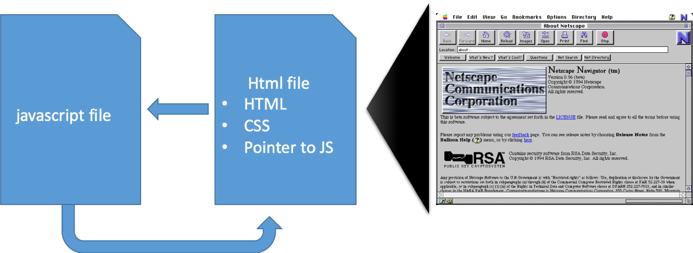

## Programming is important!

We'll be using three languages:
* JavaScript
* HTML
* CSS


## Why do we need to program?
* You can handle bigger projects and more data through automation and logic.
* This is the standard way that serious web mapping and web GIS is done.
* It looks great on your resume!



## HTML
* HyperText Markup Language
  * Files sent from servers to personal computers
  * They tell the computer things like what to display or where to get data
* HTML elements tell us things about where text should go, how it should be displayed, if an image should be centered
  * We express HTML elements through HTML tags
    * ```<html> ... </html>```
* http://html.com/document/

## CSS
* Cascading Style Sheet
  * “Style sheet” code used to style the content of a web page.
  * Interacts with HTML and describes how things should be sized, coloured, etc.
    * Can be more complicated
* Helps separate the website content from website styling
  * Reduces repetition if you have multiple HTML docs
* http://www.w3schools.com/css/default.asp

## JavaScript
* The de facto lingua franca of the world wide web
* Controls the behaviour of a webpage
  * HTML and CSS just describe
* Javascript is a programming language
  * Conditional statements
  * Logic
  * Looping
  * Data manipulation/handling
