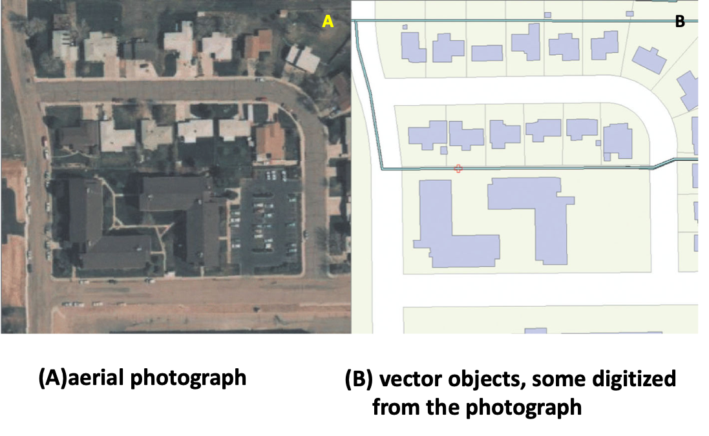
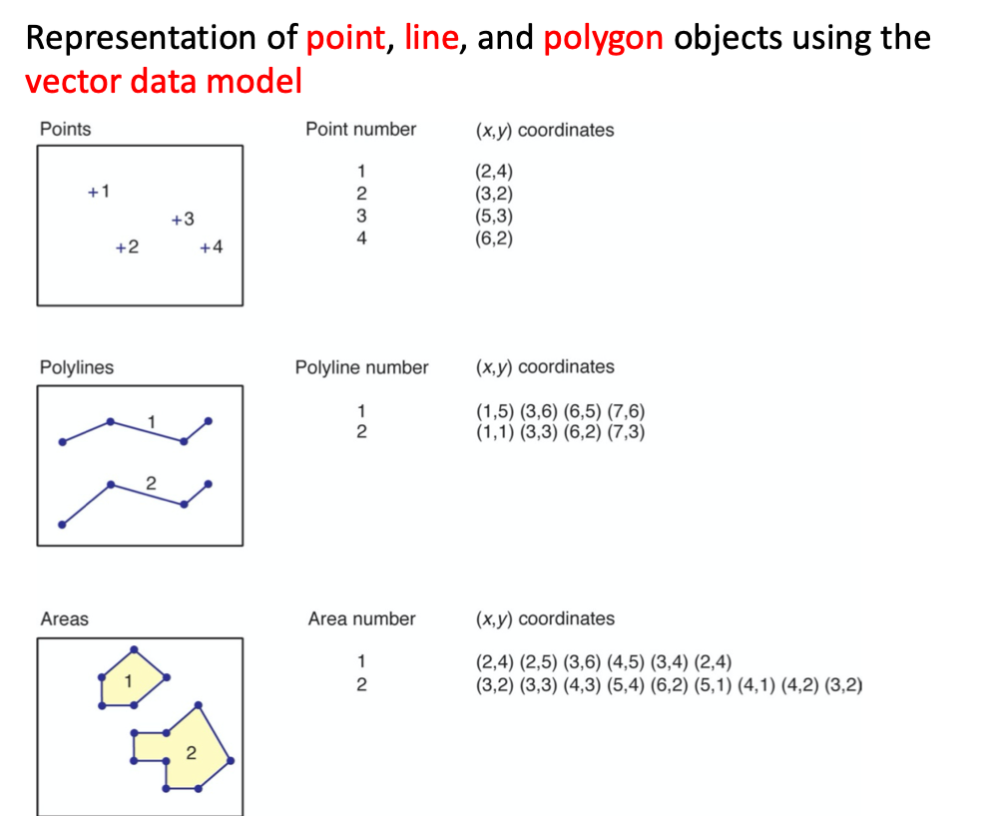
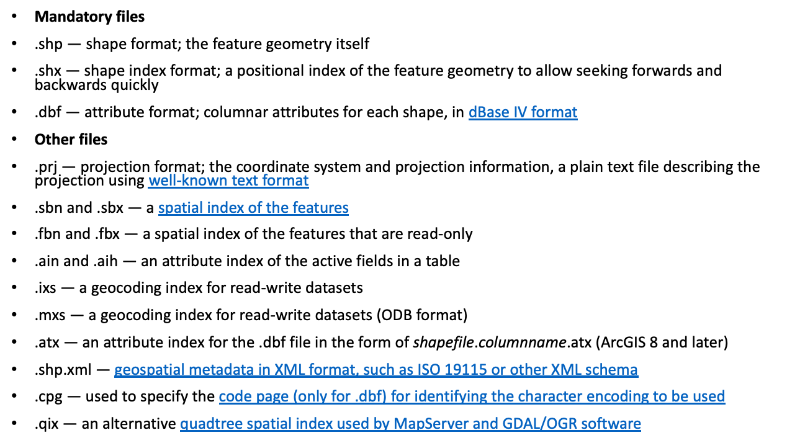
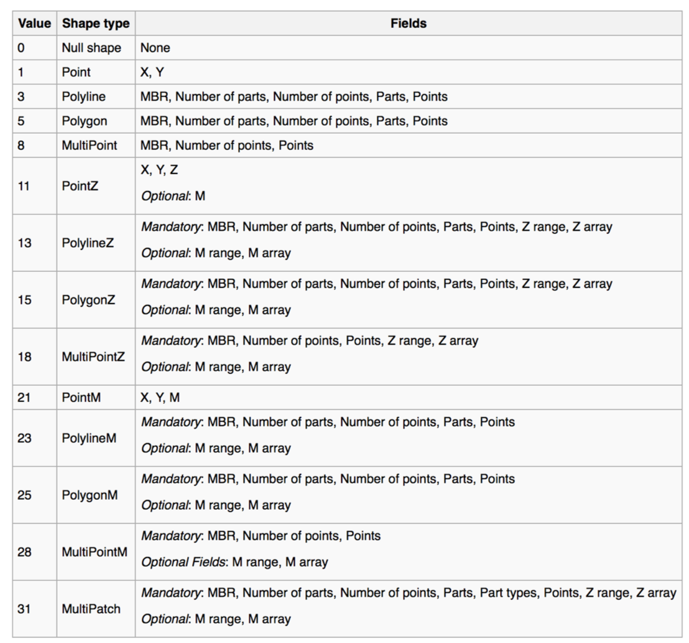
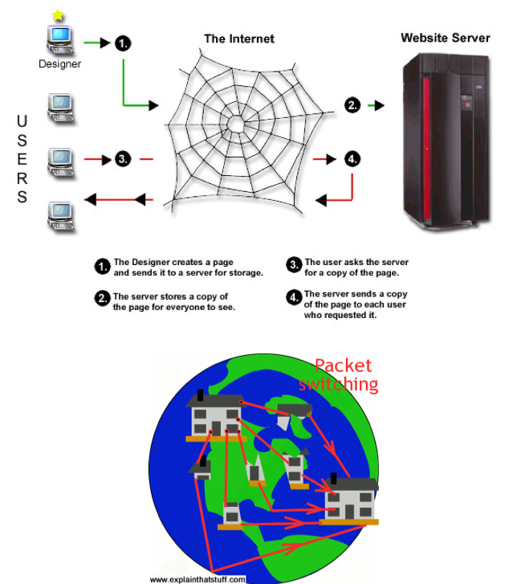

## Spatial Data Review
#### Refresher:
* Points
* Lines
* Polygons

How do we deal with these things in a computer?

#### Data Model
* a set of constructs for describing and representing selected aspects of the real world in a computer.
* We need a model because the real world is infinitely complex.



#### Raster files:
``` text
ncols 480
nrows 450
xllcorner 378923
yllcorner 4072345
cellsize 30
nodata_value -32768

43 2 45 7 3 56 2 5 23 65 34 6 32 54 57 34 2 2 54 6 ...
35 45 65 34 2 6 78 4 2 6 89 3 2 7 45 23 5 8 4 1 62 ...
43 2 45 7 3 56 2 5 23 65 34 6 32 54 57 34 2 2 54 6 ...
35 45 65 34 2 6 78 4 2 6 89 3 2 7 45 23 5 8 4 1 62 ...
43 2 45 7 3 56 2 5 23 65 34 6 32 54 57 34 2 2 54 6 ...
35 45 65 34 2 6 78 4 2 6 89 3 2 7 45 23 5 8 4 1 62 ...
```

#### Vector Data Model
* More commonly associated with discrete data Concepts
* Three general geometric types
  * Point
  * Polyline
  * Polygon

### How do these look in the computer? It depends...
#### At the most basic level:


#### What about shapefiles?



### This is a lot of information and not particularly efficient.
That leads us to web mapping. Are shapefiles the way to go? Well, to understand why they aren't, it's helpful to understand a little about the internet.

* Packet switching
  * Data are broken into small chunks and passed from an origin to a destination
  * Allows for many routes to the destination computer
* Servers
  * Electronic filing cabinets that pass information when requested
* Clients
  * Computers that get information from servers


