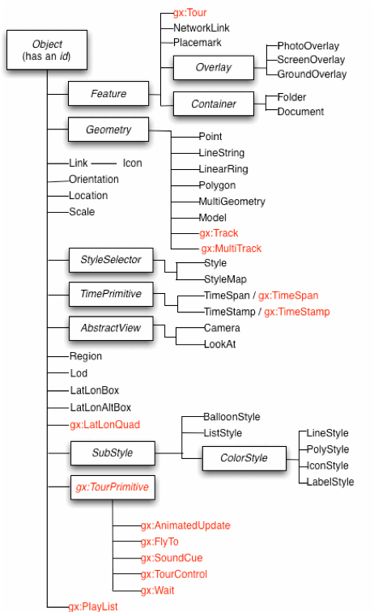
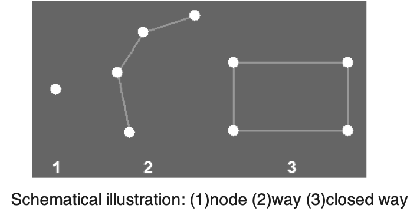

#### GML
GML defines a variety of object types:
* Features
* Coordinate reference systems
* Geometry (simple and complex)
* Topology
* Time
* Units of Measure
* Generalized values

GML geometries:
* Point
* LineString
* Polygon
* Newer versions of GML have the ability to represent coverages/raster

``` html
<gml:Polygon>
    <gml:outerBoundaryIs>
            <gml:LinearRing>
                    <gml:coordinates>0,0 100,0 100,100 0,100 0,0</gml:coordinates>
            </gml:LinearRing>
   </gml:outerBoundaryIs>
</gml:Polygon>

<gml:Point>
   <gml:coordinates>100,200</gml:coordinates>
</gml:Point>

<gml:LineString>
   <gml:coordinates>100,200 150,300</gml:coordinates>
</gml:LineString>
```

#### KML
KML extends GML and maintains an open standard: [OpenGIS KML Encoding Standard](https://developers.google.com/kml/documentation/kmlreference)



##### Four basic ways to display data:
* Placemarks
* Polylines
* Polygons
* Overlays

Difference between polylines and polygons is the first and last point is the same for polygons.

[Examples of how KML can be used here.](https://renenyffenegger.ch/notes/tools/Google-Earth/kml/index)

#### OSM XML

[OpenStreetMap](http://openstreetmap.com) XML is tag based, but not standardized in practice. It's based on XML, with different tags than GML/KML.

Geometries:
* Node
* Way
* Closed way



``` xml
<node id="60006651" visible="true" version="8" changeset="14929023" timestamp="2013-02-06T02:06:38Z" user="andrewpmk" uid="1679" lat="43.6629666" lon="-79.3974730"/>


<way id="8027962" visible="true" version="13" changeset="29433309" timestamp="2015-03-12T19:30:13Z" user="andrewpmk" uid="1679">  
<nd ref="60006651"/>  
<nd ref="2143468180"/>
<nd ref="60006652"/>  
<nd ref="60006653"/>  
<nd ref="60006655"/>  
<nd ref="60006647"/>  
<nd ref="60006648"/>  
<nd ref="60006649"/>  
<nd ref="60006650"/>  
<nd ref="60006651"/>
<tag k="addr:city" v="Toronto"/>  
<tag k="addr:country" v="CA"/>  
<tag k="addr:housenumber" v="73-75"/>  
<tag k="addr:province" v="ON"/>  
<tag k="addr:street" v="St. George Street"/>  
<tag k="building" v="university"/>  
<tag k="college" v="University College"/>  
<tag k="name" v="Sir Daniel Wilson Residence (University College)"/>  
<tag k="operator" v="University of Toronto"/>
</way>

```

# Go to OpenStreetMap and download some data. Inspect nodes/ways/closed ways.
