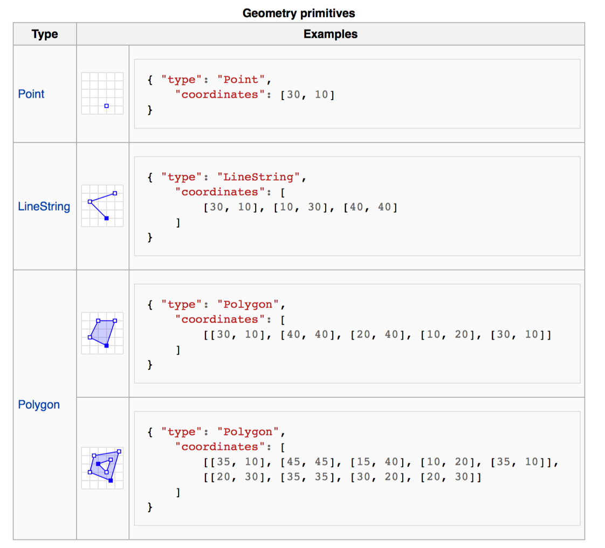

#### Geometries in geojson are similar to the other online formats we've explored.

* Point = Point
* Line/polyline = LineString
* Polygon = Polygon



```javascript
{ "type": "Point",
	"coordinates": [30,10]
}
```

```javascript
{ "type": "LineString",
	"coordinates": [
			[30,10], [10,30],[40,40]
		]
}
```

```javascript
{ "type": "Polygon",
	"coordinates": [
			[30,10], [40,40], [20,40], [10,20],[30,10]
		]
}
```

```javascript
{ "type": "Polygon",
	"coordinates": [
			[[35,10], [45,45], [15,40], [10,20],[35,10]],
			[[20,30], [35,35], [30,20], [20,30]]
		]
}
```
