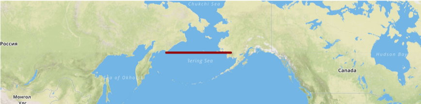

#### The dateline!

##### Lines and polygons are a collection of points
##### The points shoudl be within -180 and 180 degrees longitude
##### Does a LineString go from -179 to 179 longitude go all the way around the world or just across the dateline?

Solution: use 179 to 181 ... it's a hack, but it works.

