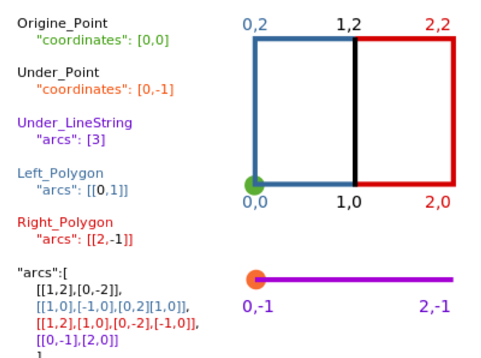

#### TopoJSON

* GeoJSON that enforces topological rules
	* Preserves connections between lines
* Preserves adjacency
	* Useful for network analysis/spatial relations
* More complicated mark-up language
	* Uses concept of arcs

