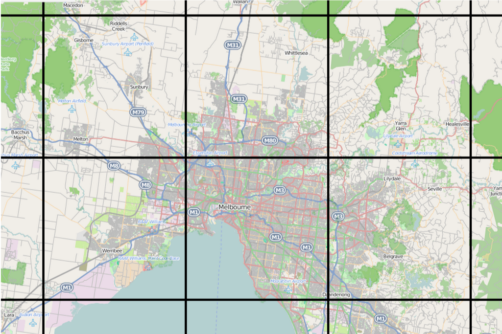
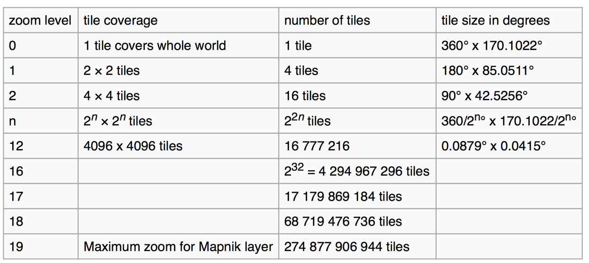
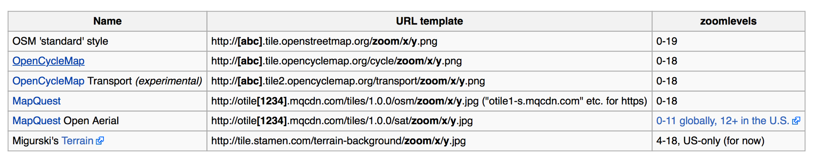
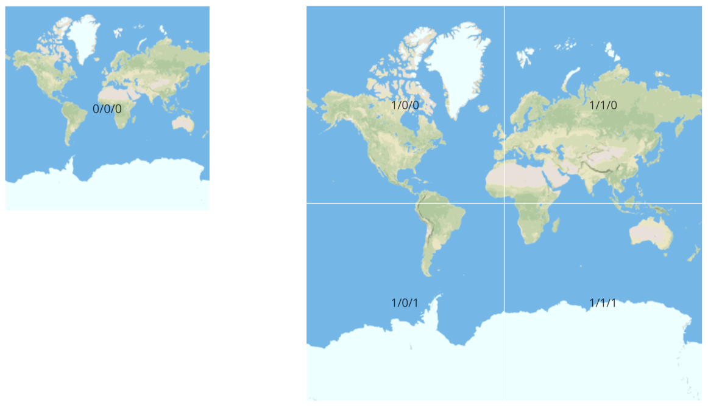

## Web Cartography and Visualization

* Slippy Maps
	* They slip as a user clicks and holds, dragging the map around in the browser
* Conventions
	* 256x256 pixel PNG files
	* Each zoom level is a directory, each column is a subdirectory, and each tile is a file (.PNG)
	* Filename format is: /zoom/x/y.png

Different web maps have different tile conventions. At a basic level, a web map has a number of zoom levels.

At each zoom level there are a collection of tiles, each representing a predefined area in space.

If you're zoomed out (low resolution) there are fewer tiles. If you're zoomed in, there are more tiles.

The tiles are generated using the geojson data (or OSMXML etc.) we've been working with.

## Try out [an interactive example](http://www.maptiler.org/google-maps-coordinates-tile-bounds-projection/)

#### If we're working with image tiles we refer to them as raster tiles. If we're working with vector (continuous) information, we use the term vector tiles.

## Updates to individual tiles

#### Tiles are updated as data is tweaked.

#### As an example, in OSM:
* In the past weekly updates of tiles based on edits made to OSM
	* Now, more fluid updates to tiles occur
	* http://wiki.openstreetmap.org/wiki/Slippy_Map#Mapnik_tile_rendering
* http://tile.openstreetmap.org/10/286/373.png
	* The tile
* http://tile.openstreetmap.org/10/286/373.png/status
	* Information on the tile, time of last render
* http://tile.openstreetmap.org/10/286/373.png/dirty
	* Force a re-rendering of tile
