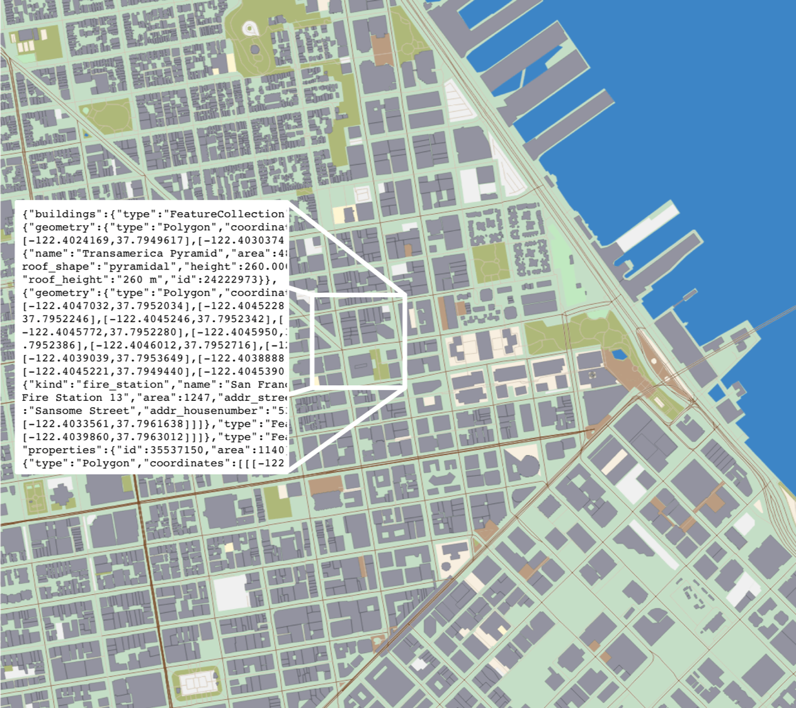

#### What are Vector Tiles?
#### And how do they differ from raster tiles?
* Raster tiles are pixelated images of maps
	* http://www.openstreetmap.org/
* Vector tiles are pure data
	* Descriptions of geometry, objects, names, etc.
	* http://www.google.ca/maps

#### Same benefits as raster tiles: caching, scaling, moving map around

### Additionally:
#### Styling: vectors can be styled when requested
##### We can change the display characteristics of points, lines, polygons
##### Not pre-rendered
#### Size: vector tiles are really small, which makes them high resolution and fast!
##### Only 20-50% the size of equivalent raster tiles
