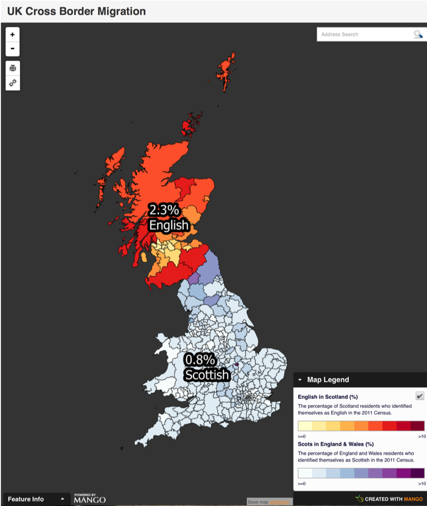
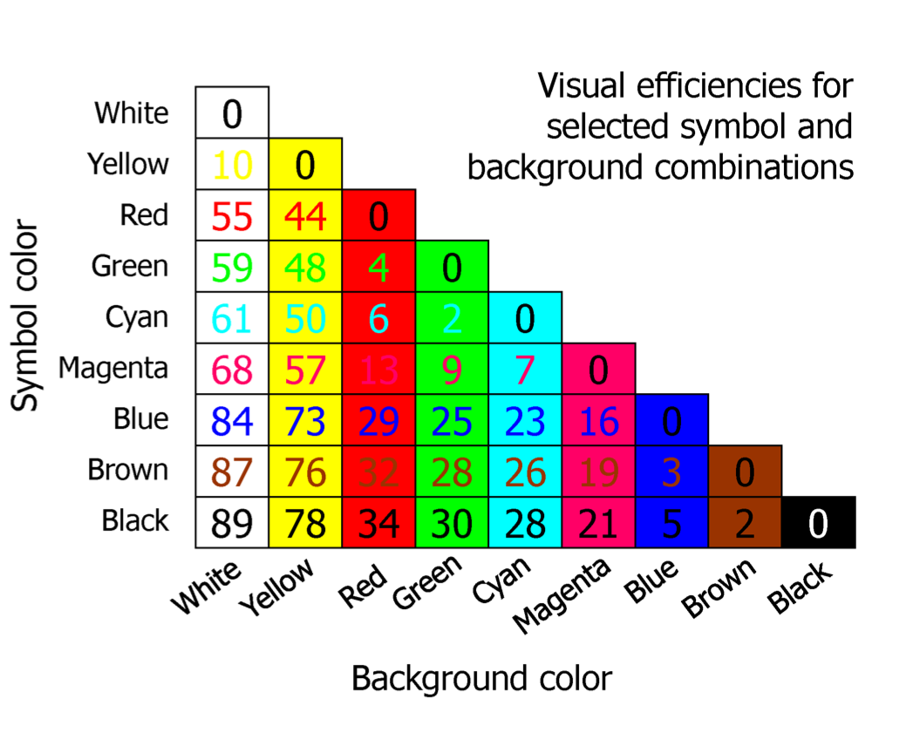
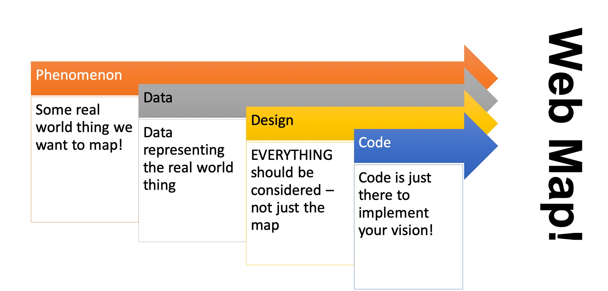

## Cartographic Considerations

#### Delivery of maps to users is rather specific
* People “consume” these maps via the internet
* Allows for some cartographic considerations to be made at a general level

#### However, different devices may require customization
* For example, phone vs. tablet vs. laptop vs. desktop
* Mostly an issue for webPAGE development, not web maps

## Think like a web designer

* Communicating spatial information!
	* Need to hold the attention of your user
* General guidelines:
	* Bigger fonts
	* Bigger buttons
	* Brighter colors
	* Fewer distractions!

## Colors

* Light colors can be overly bright and too harsh on the eye
	* Can also affect clarity of boundaries
* Background/foreground color combos
	* Need to make sure text is visible given the colors in the background.
	* Avoid washing out text in the foreground
		* Visual efficiency

## Fonts

## Web mapping process

