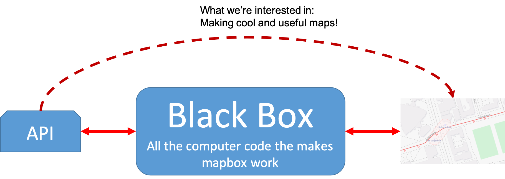

### Recap

* We’ve learned about
  * The history of web maps
  * Common data structures
  * Raster and vector tiles
  * How to upload data & create tiles in Mapbox
  * How to stylize tiles in Mapbox

#### We could make our maps manually, but...

* Time consuming
* Hard to automatically updates
* Limited features available to us

#### A programming interface will allow for faster updates and more advanced features.
* We can also customize our projects way more than we could manually
* We can also integrate interaction, loops, conditionals, etc.

#### We'll use JavaScript.
* Supported by all modern web browsers
* Object oriented
* Lots of great APIs
  * Application programming interface
* APIs
  * Essentially a tool box that you access through computer code
  * Pre-written methods/functions that you can call that complete common tasks

