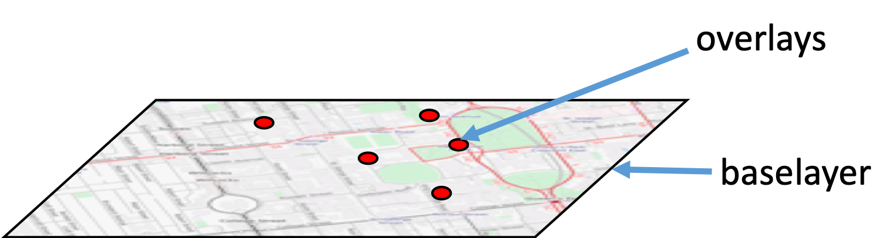

* Many different APIs out there.
  * Leaflet
  * <Google, Bing, Yahoo, etc.> Maps API
  * Mapzen
  * Mapbox JS
  * Mapbox GL JS
* We’re going to use Mapbox GL JS
  * Uses WebGL (web graphics library)
  * 3d/2d graphics in web browsers (desktop/mobile) without plugins.
    * GPU (graphics processing unit) driven – video game-like graphics
      * http://eyes.nasa.gov/curiosity/
  * Open source
    * maintained by Mapbox: https://github.com/mapbox/mapbox-gl-js

#### One advantage of using GL/vector tiles vs. raster tiles:

* Layers
  * Mapbox JS and Leaflet have baselayers and overlays
    * Baselayers: image tiles that make up the basemap, lots of data but not very interactive
    * Overlays: usually vector data like geojson, contain less data but more interactive
  * Mapbox GL JS sends data to the client, along with certain rules saying how to visualize it – NO DISTINCTION

