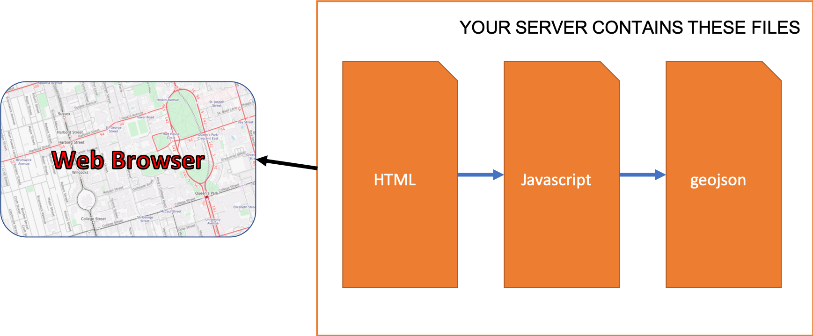

To add GeoJSON data we would use the following code, if we want to manually add GeoJSON code:

```javascript
map.addSource('my-data', {
  "type": "geojson",
  "data": {
    "type": "Feature",
    "geometry": {
      "type": "Point",
      "coordinates": [-77.0323, 38.9131]
    },
    "properties": {
      "title": "Mapbox DC",
      "marker-symbol": "monument"
    }
  }
});
```

OR we can point to a .geojson file:

```javascript
map.addSource('my-data', {
  "type": "geojson",
  "data": "./mygeojsonfile.geojson"
});
```

In both examples above, the "my-data" label is what we call the "source ID". This is how we will access/refer these data inside the rest of our javascript code.

How are our files organized on our server?


