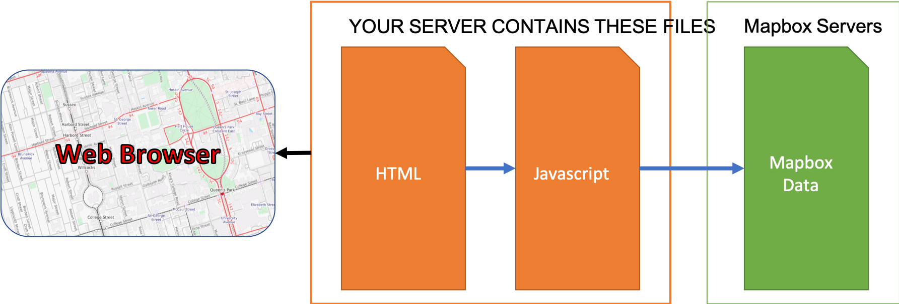

If we want to add data from the Dataset section of our mapbox portal, we can make a direct reference to those data using the addSource() method.

```javascript
map.addSource('my_data',{
  "type": "vector",
  "url": "mapbox://mwidener.3259jdk2" //link to data from mapbox site
})
```


