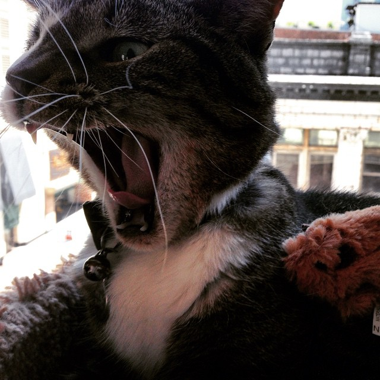

### We can create pop-ups relatively easily in mapbox.

We first want to think about:
* When do we want a pop-up to happen?
* For what layers do we want the pop-up to be related to?

#### Typically we use hover or click events with pop ups.

Let's try both:

### Hover
* Start with the standard HTML file and most of the boilerplate JS
  * (addSource, addLayer, etc.)
* We need to add to our last JS file the following:
  * change the pointer to a let the user know the map is interactive
    * glove to pointing finger
  * add a pop-up component via the [pop-up method](https://docs.mapbox.com/mapbox-gl-js/api/#popup)

Data for this code:
* [Canadian Provinces GeoJSON](CanadianProvinces.geojson)
* [Canadian Mountainlion Image](canadianmountainlion.jpg)

```javascript
var map = new mapboxgl.Map({
    container: 'map', //container id in HTML
    style: 'mapbox://styles/mwidener/cjcouhmq03m9t2rmvgnmmsr1l',  //stylesheet location
    center: [-102.542951,59.650162],  // starting point, longitude/latitude
    zoom: 2.5 // starting zoom level
});

//SIMPLY ADDING A POLYGON OF PROVINCES FROM MAPBOX VECTOR TILES
map.on('style.load', function(){

    map.addSource('provinces',{
        'type': 'vector',
        'url': 'mapbox://mwidener.6sokce8y'
    });

    map.addLayer({
        'id': 'provinces-fill',
        'type': 'fill',
        'source': 'provinces',
        'layout': {},
        'paint': {
            'fill-color': 'red',
            'fill-opacity': 1,
            'fill-outline-color': 'white'
        },
        'source-layer': "CanadianProvinces-5onu90"
    });
})

//*********************************
//POP UPS, CLICKS, HOVERS
//*********************************

// if the mouse enters the province fill layer then do the following:
map.on('mouseenter','provinces-fill',function(e){
       map.getCanvas().style.cursor = 'pointer'; //make the mouse cursor pointy
       });
// if the mouse leaves the province fill layer then do the following:
map.on('mouseleave','provinces-fill',function(e){
    map.getCanvas().style.cursor = ''; //go back to the null cursor
});

// FIRST ADD A POPUP OBJECT
var popup = new mapboxgl.Popup({
        closeButton: false,
        closeOnClick: false
});

// NEXT DEFINE WHEN YOU WANT THE POPUP TO HAPPEN
map.on('mousemove','provinces-fill', function(e){
    popup.remove(); //If a popup already exists, get rid of it!

    //get the rendered features that belong to the provinces-fill layer
    var features = map.queryRenderedFeatures(e.point, {
        "layers": ["provinces-fill"]}
    );

    //if there is a feature there, do the following
    if (features.length > 0){
        console.log(features[0]); //print out the first element of the features array that was selected
        var feature = features[0]; //store the first element as 'feature'
        popup.setLngLat(e.lngLat); //place the popup window at the lng and lat where your click event happened
        //add stuff to the pop up:
        popup.setHTML("<b>The province you clicked on is:</b> " + feature.properties.PRVNAME + "<br>"+
                      "Here is a picture of a dangerous Canadian Mountain Lion, known to roam these parts: <br>" +
                      "<center></img></center>");
        popup.addTo(map); //finally add the pop up to the map

    }
    //if there are no features under the click, then print this in the web browser console
    else{
        console.log("no features from layer here...")
    }
});
//*********************************
//POP UPS
//*********************************
```

## What happens if you remove the ```popup.remove();``` code?
## What happens if you change the pop-up code to mouseenter?
